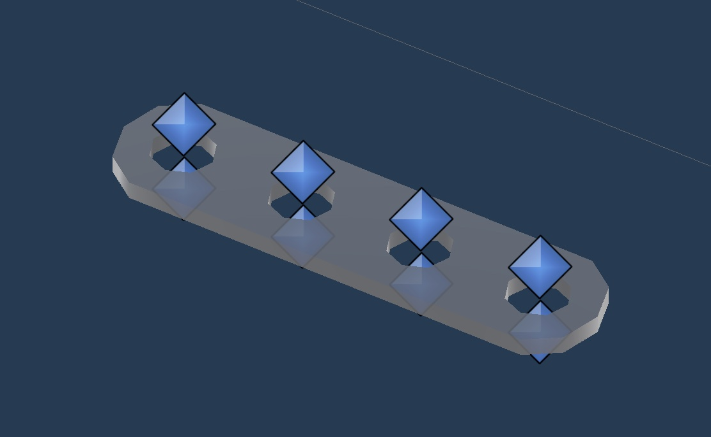
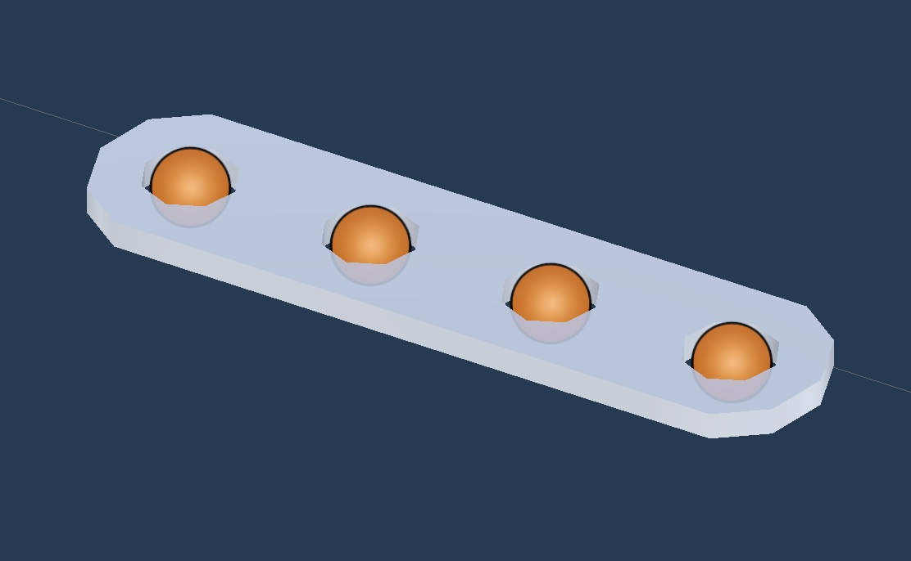
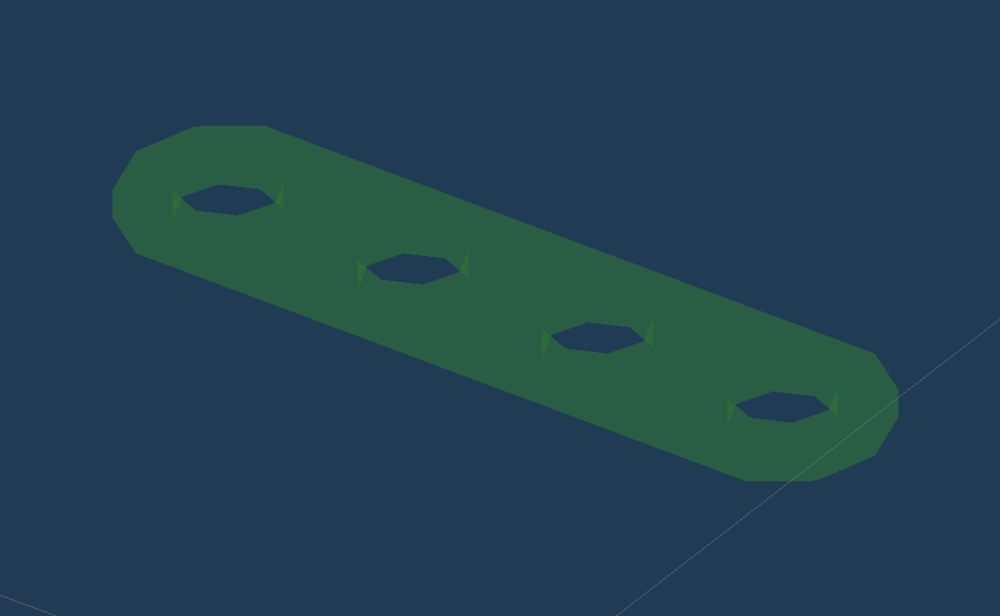

# Future of Work

Version 0.9 (C) 2023 Ethan Holen, Francisco R. Ortega, Ben Clegg. 

For non-commercial license, see: 

For commercial license, please contact Dr. Ortega [NuiLab](https://nuilab.org/)

Documentation for the [NuiLab](https://nuilab.org/) **Future of Work** project

> *Developer: [Ethan Holen](https://github.com/EthanHolen/)*

## Getting Started

### Required Installs

* Unity version [2019.4.0f1 LTS](https://unity3d.com/get-unity/download/archive)
  + Unity should prompt you to install this if you open it in unity hub

### Running

* The project itself is meant to be built on an oculus quest, i havent been able to try it on other headsets but it might work with a little tweaking.

1. Plug in your quest
2. Open the build menu when the project opens `File > Build Settings`
3. Once the build menu is up select your desired scenes
4. Set texture to `ASTC`
5. set ETC2 fallback to `32-bit`
6. Select your quest as the run device (might require a refresh)
7. Set Compression Method to `LZ4`
8. Press `Build and Run` and select whatever file you would like to store the build in
9. That should do it

 > *You will probably have to jump through some hoops on the quest to set up developer settings and stuff which is well documented on the oculus developer site*

## The Design

This project is meant to simulate building simple stuctures out of Meccano bars in a VR environment.

The bars themselves are made up of three separate components:

1. The **Base**

2. The **Builder**

3. The **Preview**

The **base** is the immovable part which starts the building process, one of these has to be put down in every scene to start off the building process. The second bar, the **builder**, is where the main interaction happens with the user. It is the grabbable piece that can be used to hover near the base and trigger the **preview** which generate from the base at certain offsets.

The preview is triggered by the **snap offsets** (orange spheres) making contact with the **snap points** (blue diamonds) on the base. The script behind this interaction is called `BuildOffset.cs`

## Data Recording

<!-- TODO: Document the data recording process -->
